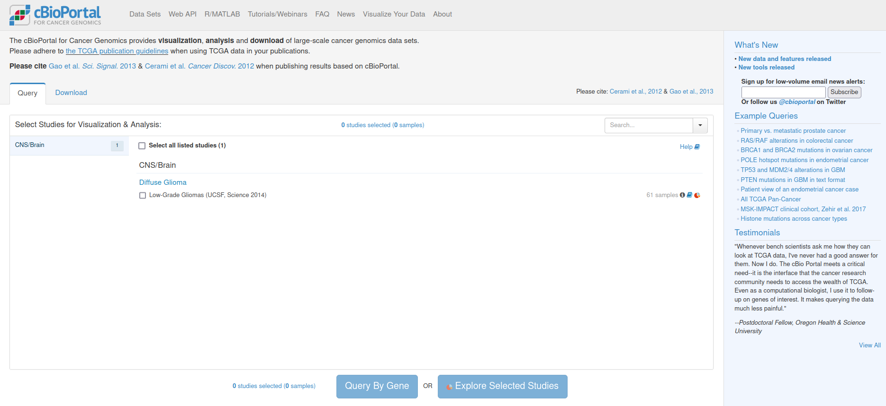
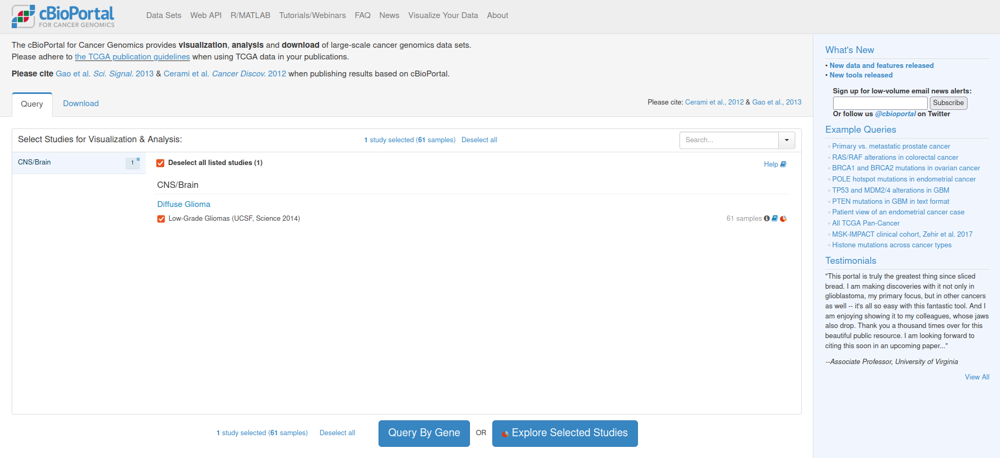
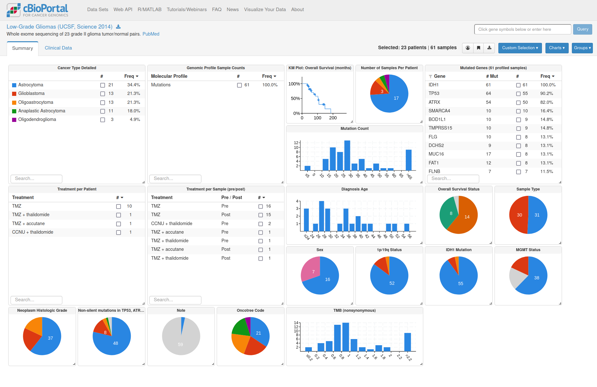

# cBioPortal Installation Instructions 

The application can be installed either within the BIBBOX environment or as a stand-alone solution. Installation instructions can be found within the BIBBOX, followed by setup instructions required once the application has been successfully installed.

## Installation within in the BIBBOX

Once you've selected the desired App for your BIBBOX instance, you can choose from the available versions, as shown in the following figure.

[Insert Figure]

Clicking "Install" will open a new window, as illustrated in the following figure. Here, you can define the necessary entries. Some fields come pre-filled with suggested options, and if left unchanged, these default values will be used as the entries.

[Insert Figure]

After confirming by clicking "Install," the App will be installed as a BIBBOX instance. Once the installation is complete, you only need to follow a few steps to use the App for the first time, which are described below.

## Setup after BIBBOX or stand-alone installation

Be patient this can take a while.

### When you start this the first time only one demo dataset is loaded

### You can check the demo data set by selecting it an clicking on Explore Selected Studies

#### Exploring Studies
A overview summary is presented when studies are expolred

### Upload your own data

To upload your own data perform the following steps:

* Upload your data to the BIBBOX-Server into the `<instantce_name>/data/cbioportal/study` folder (e.g. via fileZilla ask your server administor for access)
* Connect to your BIBBOX server via `ssh`
* Perform the following commands:
  * `cd /opt/bibbox/instances/<instance_name>`
  * `docker exec <instance_name>-cbioportal-container metaImport.py -u http://localhost:8080 -s /study/<study_name>/ -o`
  * Depending on the data set you might need to import the gene panel first:
    * `docker exec <instance_name>-cbioportal-container bash -c 'cd /cbioportal/core/src/main/scripts/ && ./importGenePanel.pl --data /gene_panels/gene_panel.txt`

## After the installation
Have a nice ride with the Admins youngtimer.

